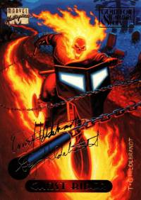

# 1994 Marvel Masterpieces

A gilded portal to the hand-painted epics of 1994.

   

Long before glossy screens and endless scrolls, Greg and Tim Hildebrandt—those twin titans of fantasy paint—brought the Marvel Universe to life in more than 140 breathtaking, hand-painted trading cards. Each brushstroke seemed to hum with the crackle of cosmic energy, capturing the raw poetry of superheroes in mid-flight and the silent menace of their greatest foes.

This page is a time capsule: a tribute to afternoons spent riffling through binder pages, where every card was a portal. Here, nostalgia isn’t just sentiment—it’s an art form.

[TO BE CONTINUED...]