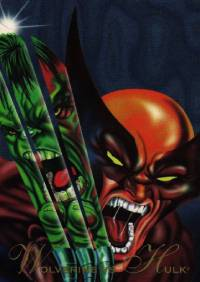
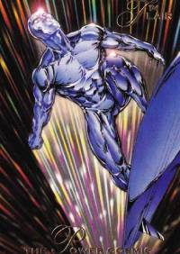
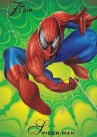
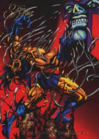

# 1994 Marvel Annual Flair

A shimmering gateway back in time.

   

Tearing into a pack of Marvel Flair 1994 Annual cards is like cracking open a time capsule from the comic-obsessed '90s. The glossy art, the chase for that rare hologram—it’s a rush that takes me right back to trading cards on the playground, dreaming of epic battles and mutant mayhem. Join me as I rip through these packs, and attempt to collect every last piece of nostalgia I can find. 

[TO BE CONTINUED...]